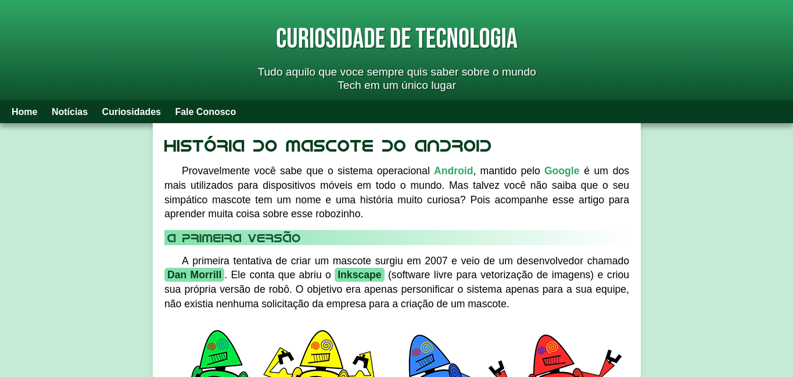

# História do Mascote do Android

Projeto desenvolvido originalmente durante os estudos de HTML e CSS e posteriormente revisado, refatorado e aprimorado para fins de portfólio.

## Preview



## Sobre o projeto

O projeto apresenta a história do mascote do Android, o Bugdroid, utilizando uma página web responsiva com HTML5 e CSS3.

Durante a revisão, foram realizados ajustes na estrutura HTML, organização do código, responsividade, segurança de links externos e compatibilidade com padrões atuais da web.

## Tecnologias utilizadas

* HTML5
* CSS3
* Design responsivo
* Media Queries
* Imagens responsivas com `<picture>`
* Variáveis CSS
* Fontes personalizadas
* Google Fonts
* Vídeo incorporado do YouTube

## Destaques

* Estrutura HTML organizada e semântica
* Layout adaptável para diferentes tamanhos de tela
* Imagens responsivas
* Uso de variáveis CSS para organização das cores e fontes
* Links externos com boas práticas de segurança
* Conteúdo multimídia integrado
* Código revisado e organizado para apresentação em portfólio

## Responsividade

A página foi desenvolvida para funcionar em diferentes dispositivos, incluindo computadores, tablets e smartphones.

## Como executar

1. Clone este repositório.
2. Abra a pasta do projeto.
3. Abra o arquivo `index.html` no navegador.

Também é possível utilizar uma extensão como **Live Server** no VS Code para executar o projeto durante o desenvolvimento.

## Estrutura do projeto

```text
historia-do-android/
├── imagens/
├── index.html
├── style.css
├── idroid.otf
├── BerkshireSwash.ttf
└── README.md
```

## Aprendizados

Este projeto reforçou conhecimentos de:

* Estrutura e semântica do HTML5
* Organização de páginas web
* CSS e estilização
* Responsividade
* Media Queries
* Imagens adaptáveis
* Organização e manutenção de código
* Boas práticas para links externos

## Autor

**Marcos Paixão**

Estudante de tecnologia e profissional de suporte técnico, atualmente direcionando a carreira para a área de TI.

[GitHub](https://github.com/Marcos-Paixao)